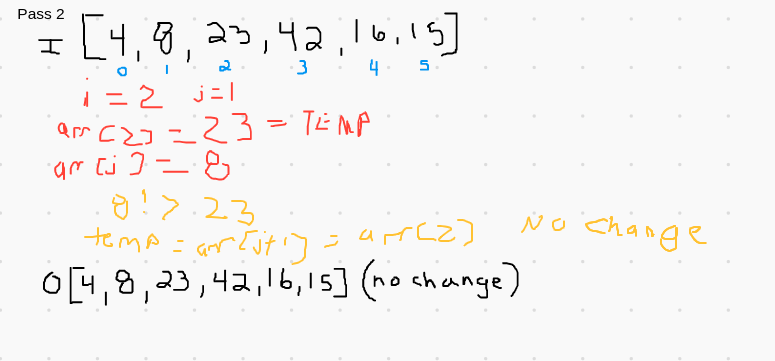

# Blog Table of Contents
[Selection Sort](#selection-sort)<br>
[Merge Sort](#merge-sort)<br>

## Selection Sort
Here I will walk through a selection sort on a test array, showing how the array
changes on each pass.
### Psuedocode
Here is the code we will be running through to sort the given array.<br>
```for( int i = 1; i<arr.length; i++){<br>
int j = i-1;<br>
int temp = arr[ i ];<br>
while ( j >= 0 && temp < arr[ j ]){<br>

  arr[ j  +1] = arr[j];<br>
  j  = j-1;

  }

arr[ j+1] = temp;<br>
}
 ``` 
### Trace
We will trace through the given array of [8,4,23,42,16,15] and sort it. 
#### Pass 1
 <br>
Our first pass through of the selection sort starts with i equal to 1 and then sets j to i-1, which is 0.
We then set an int variable called temp to the array at index 1, which is 4. Now that temp is set to the 
value of the second index, we compare it to the value at the first index.  Since it is less than that value (8),
we enter a while loop that sets the value at the current index to the value at the previous index.  So, the value at
index 1 is now 8. J is decremented down to -1, which breaks us out of the while loop.  The final line of code sets 
the value at the index of j + 1 ( which is now the index of 0) to the value from the temp variable, which is 4. The 
array now has the value of 4 at arr[0] and 8 at arr[1], and we move to the next pass.  
#### Pass 2
 <br>
On this second pass, i is now 2, which means j is set to 1 and the temp variable is assigned the value from the third index, 
which is 23.  We now compare 23 to the value at the previous index to see if it is smaller. It is not, so we go to the 
last line of code which sets value at the index 2 to the temp variable, which is 23, so there is no change.
#### Pass 3
 <br>
The third pass is much like the second.  Since i is now 3, j is set to 2 and the temp variable is now 42.  Since 42 is
larger than the value that is before it, 23, we don't ente the while loop and the current index is set to the temp value,
which is the same value, 42. The array doesn't change and we move on. 
#### Pass 4
 <br>
This pass requires a couple traversals of our while loop.  I is now 4, so j is set to 3 the temp variable is now 16. 16 is 
less than the value of the index before it, 42, so we enter the while loop.  There, the value at our current index is set to the 
value of the previous index, 42, then we decrement so that we can see if our temp variable is less than the value of the index 
before the index we just compared, 23. 16 is less than 23, so we contiue the while loop.  The value of our current index is now 
set to 23, and we decrement to compare it to value at the next index, 8.  16 is greater than 8, so we break the loop and assign 
our current index to the temp value of 16.  So, 43 and 23 both move up an index while 16 moves down 2 indexes. 
#### Pass 5
 <br>
Like pass 4, we will enter our while loop multiple times.  With i now at 5, j is set to 4 and the temp variable is now 15. 15
is less than the value of the index before it, 42, so we enter the while loop.  The value of the array at index 5 is set to 42, then 
we compare 15 to the value at index 3, 23. 15 is less than 23, so we continue the loop.  The value of the array at index 4 is set to
23 and we compare 15 to the value at index 2, 16. 15 is less than 16, so we continue the loop and set the value of the array at index 
3 to 16 and compare 15 to the value at index 1, 8. 15 is greater than 8, so we break out of the while loop and assign the value of our
current index, 2, to 15.  That is the end of the array and it is now sorted to [4,8,15,16,23,42].

## Merge Sort
We will walk through a merge sort on a test array, tracing each step of the merge.
### Psuedocode
```ALGORITHM Mergesort(arr)
   DECLARE n <-- arr.length
          
   if n > 1
     DECLARE mid <-- n/2
     DECLARE left <-- arr[0...mid]
     DECLARE right <-- arr[mid...n]
     // sort the left side
     Mergesort(left)
     // sort the right side
     Mergesort(right)
     // merge the sorted left and right sides together
     Merge(left, right, arr)

ALGORITHM Merge(left, right, arr)
   DECLARE i <-- 0
   DECLARE j <-- 0
   DECLARE k <-- 0

   while i < left.length && j < right.length
       if left[i] <= right[j]
           arr[k] <-- left[i]
           i <-- i + 1
       else
           arr[k] <-- right[j]
           j <-- j + 1
           
       k <-- k + 1

   if i = left.length
      set remaining entries in arr to remaining values in right
   else
      set remaining entries in arr to remaining values in left
```
## Trace
We will trace through the given array of [8,4,23,42,16,15] being merge sorted. 

We begin by checking if the array is bigger than 1, and if it is, we divide it into two arrays, left and right.
We then do this to left array recursively. This will take us down each left array until the last left is array of 
only one index, then we go the the right array and begin the process again.  Finally, we merge the sorted arrays. 
Here is a visual going through an array. 

 <br>
 
As you can see, we break up [8,4,23,42,16,15] into a left array, [8,4,23], and right array, [42,16,15].  We then run
mergeSort on the left array, which breaks in to a new left array, [8,4], and new right array, [23]. 
 
The new left array is still larger than one, so we run mergeSort on it yet again. This creates another left array, [8], 
and right array [4]. 

Since the left array is now down to a single index, we go back up and run mergeSort on the last right array, [8]. It is 
also down to a single index, so we merge them, which also sorts them, into a new, sorted, left array, [4,8]. 

We then get kicked back up to the last right array of [23].  This has only one index, so we merge it with the sorted left 
array, [4,8], which creates yet another sorted left array of [4,8,23].  

This kicks us all the way back up to the original right array, [42,15,15]. For reference, this is labeled as 10 in the 
visual.  We now run mergeSort on the right array, which creates a left array of [42,16] and right array of [15].  

This new left array has more than one index, so we run mergeSort on it. This creates a left array of [42] and right array 
of [16].  

The resulting left array has just one index, so we run merge sort on the right array, which also only has one index. We 
merge them, creating a new left array of [16,42].  

We move back up to the last right array of [15]. It has only one index, so we merge it with the left array, creating a new 
right array of [15,16,42].  

We are finally down to one left array, [4,8,23], and one right array, [15,16,42], which are both sorted.  We merge them, 
creating the final output array of [4,8,15,16,23,42], which is fully sorted!