# Table of Contents
[Challenge 01: Reverse an Array](#reverse-an-array) 
[Challenge 02: Array Shift](#array-shift) 
[Challenge 03: Binary Search](#binary-search) 
[Challenge 05: Linked-List](#singly-linked-list) 
[Challenge 06: Linked-List Part Two](#linked-list-part-two)  
[Challenge 07: Linked-List Part Three](#linked-list-part-three)  
[Challenge 08: Linked-List zipList](#linked-list-zipList)  
[Challenge 10: Stacks and Queues](#stacks-and-queues)  
[Challenge 11: Queue with Stacks](#queue-with-stacks)  
[Challenge 12: Animal Shelter](#animal-shelter)  
[Challenge 13: Multi Bracket Validation](#multi-bracket-validation)  
[Challenge 15: Trees](#trees)  
[Challenge 16: Find Maximum Value](#find-maximum-value)  
[Challenge 17: Breadth First](#breadth-first)  
[Challenge 18: FizzBuzz](#fizzBuzz)  
[Challenge 26: Insertion Sort](#insertion-sort)  
[Challenge 27: Merge Sort](#merge-sort)  
[Challenge 28: Quick Sort](#quick-sort)  
[Challenge 30: HashTable](#hashtable)  
[Challenge 31: RepeatedWord](#repeatedword)  
[Challenge 32: TreeIntersection](#treeintersection)  
[Challenge 33: Left Join](#left-join)  
[Challenge 35: Graph](#graph)  
[Challenge 36: Breadth First Graph](#breadth-first-graph)  

## Reverse an Array
This method will reverse the order of a given array.
### Challenge
Write a function called reverseArray that takes in an Array as an argument and returns that array in reversed order
### Approach & Efficiency
I wrote a for loop that ran half the length of the array and swapped the indexes of of the first element with the last, the second with the second to last, and so on until the array is in reverse order. 
### Solution

## Array Shift
This method will add a value to the middle of any given array.
### Challenge
Write a function called arrayShift that takes in an array and an int as an argument and returns an array with the int added to the array in the middle index.
### Approach & Efficiency
Time: O(n) 
Space O(n)
### Solution
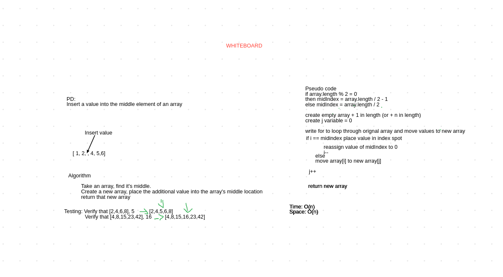

## Binary Search
This method will check to see if a value is in any given array.
### Challenge
Write a function called binarySearch that performs a search to see if a value is in an array. If there is, it returns the index of that value, if not, it returns -1.
### Approach & Efficiency
Time: O(n) 
Space O(n)
### Solution
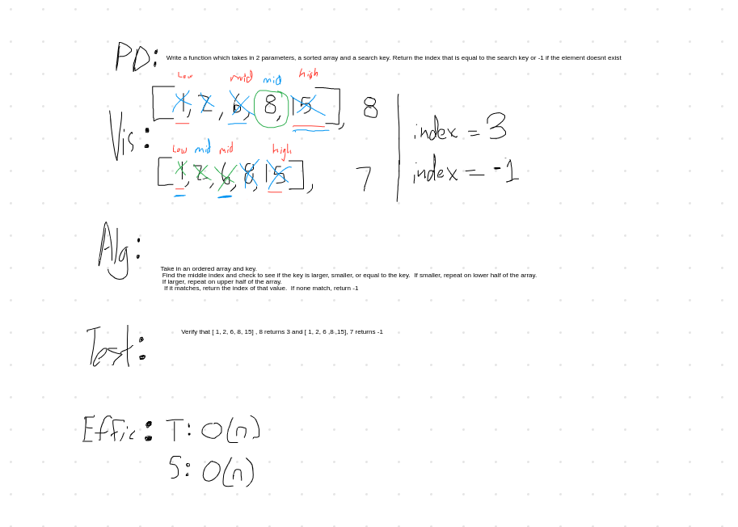

## Singly Linked List
This method will create a linked list 

### Challenge
Write a class called linkedList that contains methods to insert values into the linked list, see if a value is included in the linked list, and to stringify the list.
### Approach and Efficiency
Insert:
Time: O(1) 
Space O(n)
Includes:
Time: O(n) 
Space O(1)
toString:
Time: O(n) 
Space O(n)
### API
LinkedList methods:
#### Insert
This method takes in an integer and creates a node with that interger as it's value and sets that node to the head of the linked list.
#### toString
This method returns a string showing the linked list
#### Includes
This method takes in an integer and checks all node values, returning true if that value is found and false if not.

## Linked List Part Two
This is an expansion of methods on the previous linked list.

### Challenge
Write three new methods.  One called append that takes in an integer and appends it to the linked list, one called insertBefore that takes in two integers and searches the linked list for the value of the first int and prepends the node with a node with the value of the second int, and finally, one called insertAfter that takes in two integers and searches the linked list for a node with the value of the first int then appends that node with a node that has a value of the second int. 
### Approach and Efficiency
Append:
Time: O(1) 
Space O(n)
InsertBefore:
Time: O(n) 
Space O(1)
InsertAfter:
Time: O(n) 
Space O(1)
### Solution
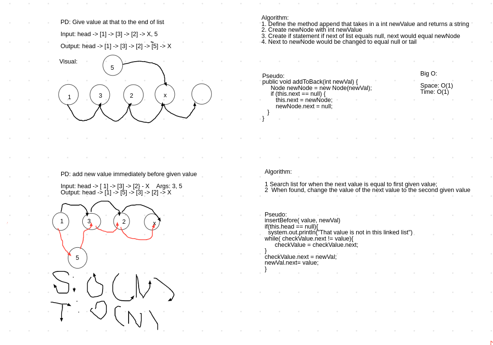

## Linked List Part Three
This adds the llKthFromTheEnd method. 

### Challenge
Write a new method that takes in k and returns the value of the kth from the end node of a linked list.
### Approach and Efficiency
Time: O(n) 
Space O(1)

### Solution
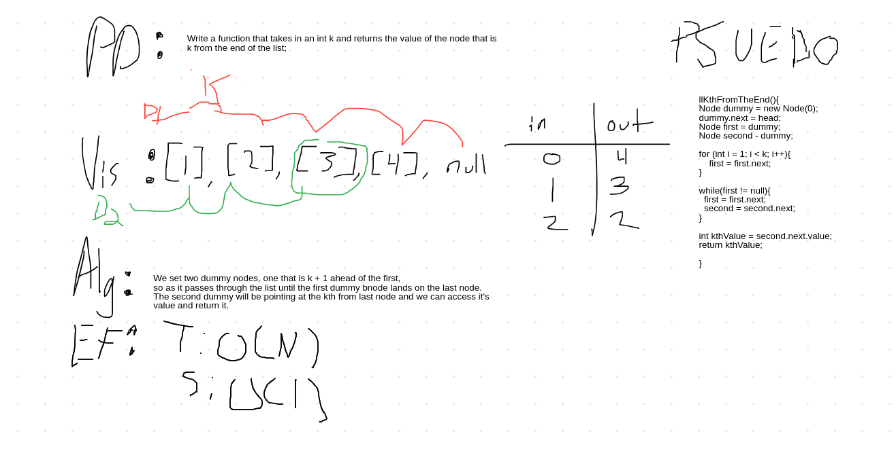

## Linked List zipList
This adds the zipList method to LinkedList

### Challenge
Write a new method that takes in two linkedlists and zips them together.
### Approach and Efficiency
Time: O(n) 
Space O(1)

### Solution
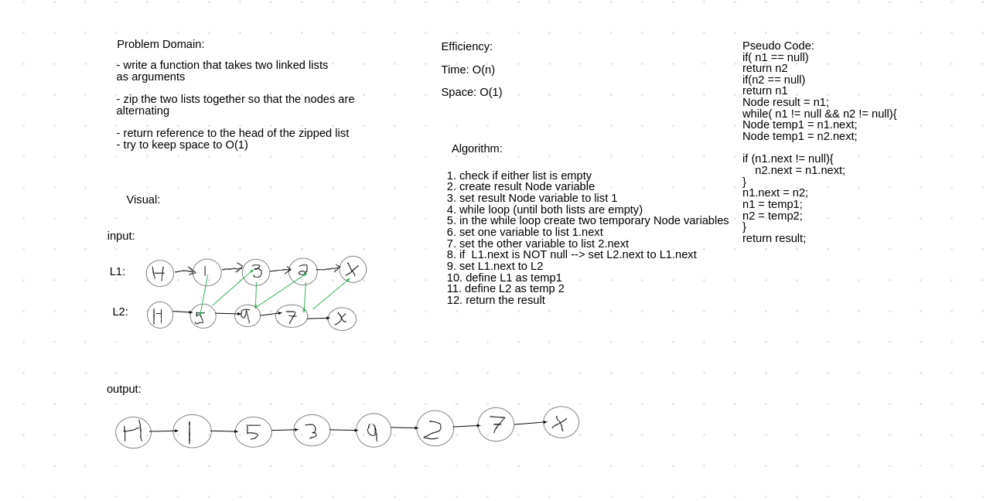

## Stacks and Queues
This creates and Stack class and Queue class

### Challenge
Write new classes called Stack, Queue, and Node.  Stack should use Nodes that creates an order that is FILO(first in last out), and queue create an order that is FIFO(first in first out). They both should have methods that add, remove, peek at first value, and check to see if they are empty.
### Approach and Efficiency
Stack Methods: 
push():
- Time: O(1) 
- Space O(1) 
pop():
- Time: O(1) 
- Space O(1) 
peek():
- Time: O(1) 
- Space O(1) 
isEmpty():
- Time: O(1) 
- Space O(1) 
Queue Methods: 
enqueue():
- Time: O(1) 
- Space O(1) 
dequeue():
- Time: O(1) 
- Space O(1) 
peek():
- Time: O(1) 
- Space O(1) 
isEmpty():
- Time: O(1) 
- Space O(1) 

### API
#### Stack Methods:
push(): Takes in an integer and adds it to the top of the stack. 
pop(): Removes the top node from the stack and returns it's value. 
peek(): Returns the value of the top node. 
isEmpty(): Checks if stack is empty.  Returns true if it is and false if it is not. 
#### Queue Methods
enqueue(): Takes in an integer and adds it to the back of the queue. 
dequeue(): Removes the front node from the queue and returns it's value. 
peek(): Returns the value of the front node. 
isEmpty(): Checks if queue is empty. Returns true if it is and false if it's not. 

## Queue with Stacks
Create a queue class using two stacks

### Challenge
Create a new queue class called PseudoQueue that uses two stacks to create a queue instead of nodes. Create enqueue and dequeue methods.
### Approach and Efficiency
enqueue(): 
- Time: O(1) 
- Space: O(1) 

dequeue(): 
- Time: O(n) 
- Space: O(1) 

### Solution
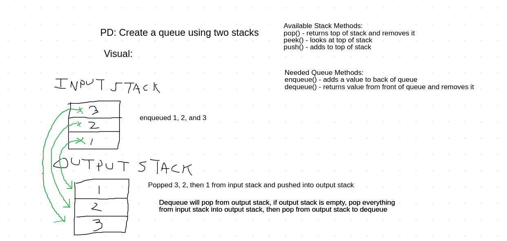

## Animal Shelter
This creates an Animal Shelter queue made up of Cats and Dogs. 

### Challenge
Create a class called AnimalShelter that creates a queue of Dogs and Cats.  An enqueue method should allow you to add an animal to the queue.  The dequeue method should return an animal of the preferred type, either cat or dog.
### Approach and Efficiency
enqueue(): 
- Time: O(1) 
- Space: O(1) 

dequeue(): 
- Time: O(n) 
- Space: O(1) 

### Solution
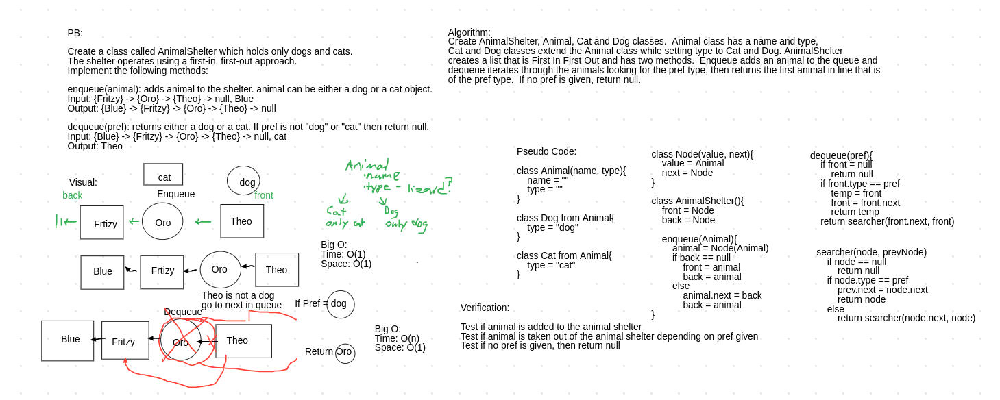

## Multi Bracket Validation
This creates a method to check if a string contains balanced brackets. 

### Challenge
Create a method called multiBracketValidation that takes in a string and checks to see if the brackets inside of it are balanced. This includes round, square, and curly brackets and can contain chars other than brackets.  

### Approach and Efficiency
multiBracketValidation(): 
- Time: O(n) 
- Space: O(n) 

### Solution
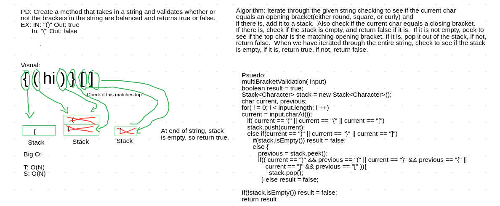

## Trees
This creates a tree data structure.

### Challenge
Create a node class that holds a value and points left and right. Create binaryTree and binarySearchTree classes, 
where the binaryTree class holds methods for retrieving values from the tree in preOrder, inOrder, and postOrder. 
The binarySearchTree should be able to add a value in a way that the tree is organized such that the value to the left
is less than the value to the right through every part of the tree. It should also have a method that searches the tree 
to see if a value is contained in the tree.  
### Approach and Efficiency
BinaryTree: 
preOrder(): 
- Time: O(n) 
- Space: O(h)(h is height of tree) 

inOrder(): 
- Time: O(n) 
- Space: O(h) 

preOrder(): 
- Time: O(n) 
- Space: O(h)( 

BinarySearchTree: 
add(): 
- Time: O(h) 
- Space: O(h)( 

contains(): 
- Time: O(h) 
- Space: O(h)( 

### API
#### BinaryTree methods
preOrder(): Takes in a Node and an empty Integer ArrayList
and returns an Interger ArrayLists with all values in the tree added
as they are encountered. 

inOrder(): Takes in a Node and an empty Integer ArrayList
and returns an Integer ArrayLists with all values in the tree added
when they do not have a left or if their left node as already been added.

postOrder(): Takes in a Node and an empty Integer ArrayList
and returns an Integer ArrayLists with all values in the tree added
when they do not have a left or a right or if their left and right nodes have already been added.

#### BinarySearchTree methods
add(): Takes in an Integer and adds it to the tree where it's value is higher than those to it's left
but lower than those to it's right.     

contains(): Takes in an Integer and returns truee if that value is contained in the tree and 
false if it is not.         

## Find Maximum Value
This method finds the maximum value of a tree.

### Challenge
Create a method called findMaxValue that walks through a tree and returns the value that is the greatest. 

### Approach and Efficiency
multiBracketValidation(): 
- Time: O(n) 
- Space: O(1) 

### Solution
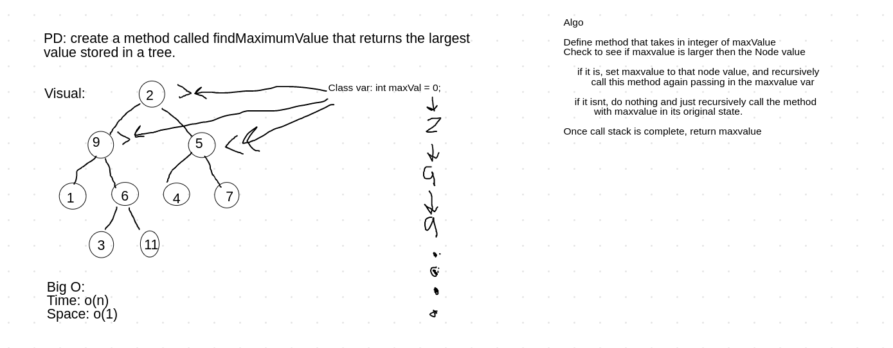 

## Breadth First
This method traverses a tree in breadth first order.

### Challenge
Create a breadth first traversal method that takes in a binary tree and returns a list of the values in
the tree in leveled order.

### Approach and Efficiency
breadthFirst(): 
- Time: O(n) 
- Space: O(n) 

### Solution
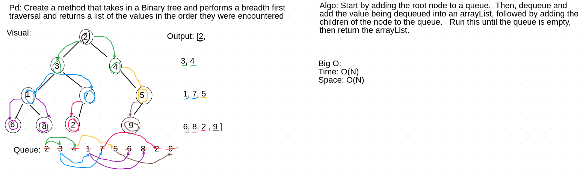 

## FizzBuzz
This method takes in a tree, traverses it, and returns a new tree with modified values.

### Challenge
Create a method that takes in a tree and returns a new tree where the values are modified such that: 
- If the value is divisible by 3, replace the value with “Fizz” 
- If the value is divisible by 5, replace the value with “Buzz” 
- If the value is divisible by 3 and 5, replace the value with “FizzBuzz” 
- Otherwise, turn the value into a String.

### Approach and Efficiency
fizzBuzz(): 
- Time: O(n) 
- Space: O(n) 

### Solution
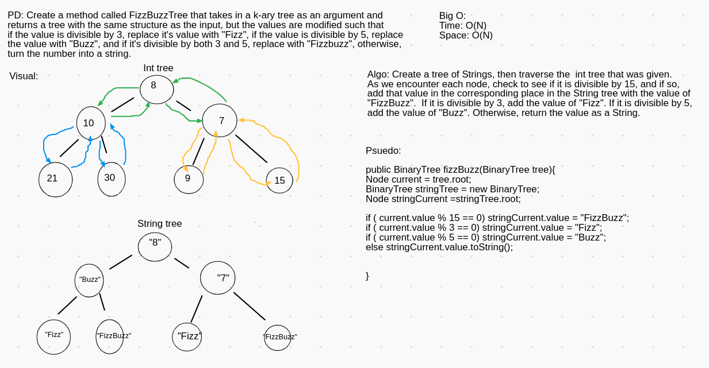 

## Insertion Sort
This method sorts an array by value from lowest to highest. 

### Challenge
Create a method that takes in an int array and returns an array that is sorted by value from lowest to highest.

### Approach and Efficiency
insertSort(): 
- Time: O(n^2) 
- Space: O(1) 

### Solution
[Blog](BLOG.md)

## Merge Sort
This method sorts an array by value from lowest to highest. 

### Challenge
Create a method that takes in an int array and returns an array that is sorted by value from lowest to highest. It should
do this by dividing the array in half recursively until you can no longer divide it, then performing a sort that merges
each set of two arrays while sorting them. 

### Approach and Efficiency
insertSort(): 
- Time: n(log n) 
- Space: O(n) 

### Solution
[Blog](BLOG.md)

## Quick Sort
This method sorts an array by value from lowest to highest. 

### Challenge
Create a method that takes in an int array and returns an array that is sorted by value from lowest to highest. It should
do this by creating a pivot and putting it in it's correct position and putting all smaller elements before it and all 
greeater elements behind it.  
### Approach and Efficiency
insertSort(): 
- Time: O(log n) 
- Space: O(n) 

### Solution
[Blog](BLOG.md)

## HashTable
This creates a HashTable data structure.

### Challenge
Create a HashTable that stores key/value pairs. HashTable should contain methods to add a key-value pair, check if the HashTable contains a key, 
return a value using a key, and also a method to hash the keys.  
### Approach and Efficiency
add(): 
- Time: O(1) 
- Space: O(1) 

get(): 
- Time: O(1) 
- Space: O(1) 

contains(): 
- Time: O(1) 
- Space: O(1)( 

### API
#### HashTable Methods
add(): Takes in a string key and int value and stores them in the HashTable, throwing an exception if that key already exists.

get(): Takes in a string key and returns the int value that it is paired with in the HashTable. If the given key does not exist in the 
HashTable, it throws an error. 

contains(): Takes in a string key and checks if that key exists in the HashTable. If it does, the method returns true. If not, it returns false.

 
## RepeatedWord
This method takes in a large string and returns the first repeated word contained in that string. 

### Challenge
Create a method that takes in large string and returns the first word to occur more than once in that 
provided string. 
### Approach and Efficiency
repeatedWord(): 
- Time: O(n) 
- Space: O(n) 

### Solution
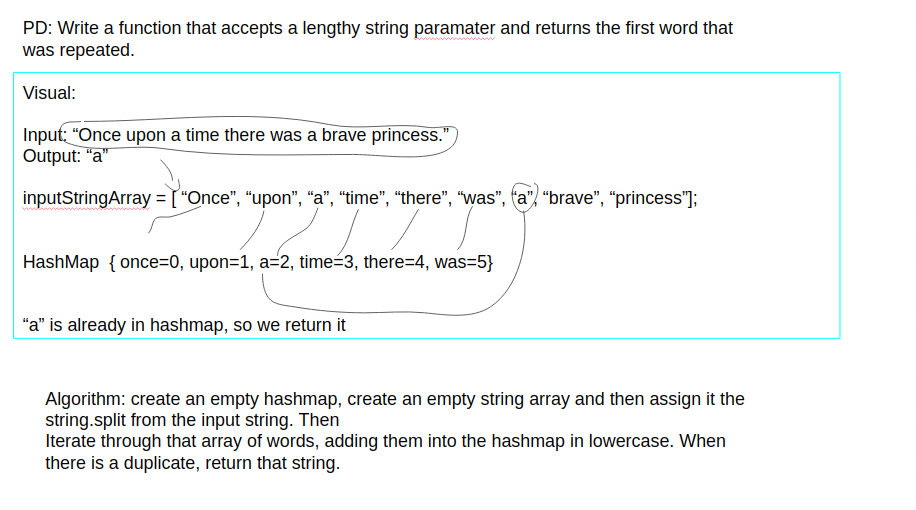 

## TreeIntersection
This method takes in two trees and returns dublicates.

### Challenge
Create a method that takes in two binary trees and returns a set that contains all the values that appear in 
both trees. 
### Approach and Efficiency
treeIntersection(): 
- Time: O(n) 
- Space: O(n) 

### Solution
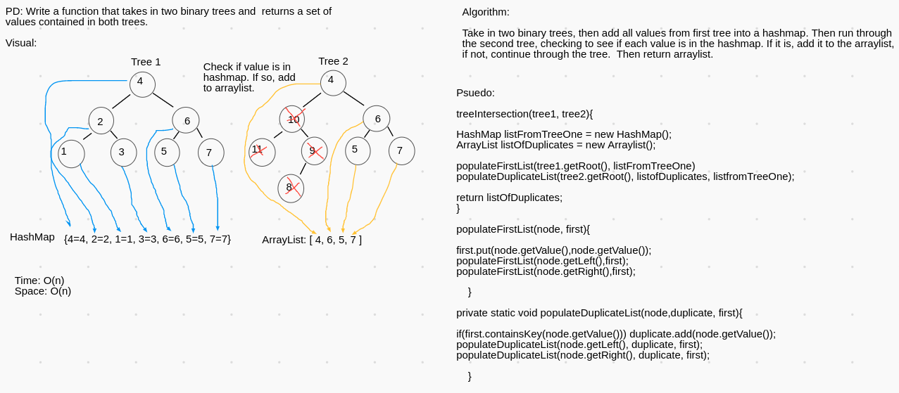 

## HashTable
This creates a HashTable data structure.

### Challenge
Create a HashTable that stores key/value pairs. HashTable should contain methods to add a key-value pair, check if the HashTable contains a key, 
return a value using a key, and also a method to hash the keys.  
### Approach and Efficiency
add(): 
- Time: O(1) 
- Space: O(1) 

get(): 
- Time: O(1) 
- Space: O(1) 

contains(): 
- Time: O(1) 
- Space: O(1)( 

### API
#### HashTable Methods
add(): Takes in a string key and int value and stores them in the HashTable, throwing an exception if that key already exists.

get(): Takes in a string key and returns the int value that it is paired with in the HashTable. If the given key does not exist in the 
HashTable, it throws an error. 

contains(): Takes in a string key and checks if that key exists in the HashTable. If it does, the method returns true. If not, it returns false.

## Left Join
This method performs a left join on two hashmaps. 
### Challenge
This method takes in two hashmaps and returns an array of arrays that has the key from the first hashmap and the value that 
goes with that key from either hashmap. If the second hashmap does not contain a key from the first, return null. 
### Approach and Efficiency
leftJoin: 
- Time: O(n) 
- Space: O(n) 

### Solution
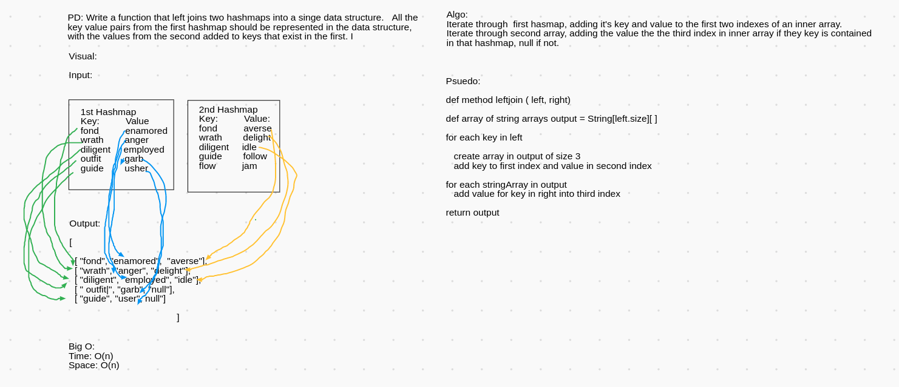 

## Graph
This creates a graph data structure. 

### Challenge
Implement a graph with methods to add nodes, add edges, get nodes( returns all nodes in some sort of data set), 
get neighbors(returns neighboring nodes of the current node in a data set), and get size of graph. 
### Approach and Efficiency
addNode(): 
- Time: O(1) 
- Space: O(n) 

addEdge(): 
- Time: O(1) 
- Space: O(1) 

getNodes(): 
- Time: O(1) 
- Space: O(1) 

getNeighbors(): 
- Time: O(1) 
- Space: O(1) 

size(): 
- Time: O(1) 
- Space: O(1)( 

### API
#### Graph Methods
addNode(): Takes in a String and then creates a node with the String as it's value and adds it to the Graph. Returns that Node.

addEdge(): Takes in two nodes ( with the ability to add an int weight) and creates an edge that connects the two nodes to each other.

getNodes(): Returns an ArrayList that contains all nodes in the graph. 

getNeighbors(): Takes in a node and returns an ArrayList with all connecting edges. 

size(): returns an int of the number of nodes in the graph.  

## Breadth First Graph
This method performs a breadth first traversal of a graph. 
### Challenge
Take in a a starting node and traverse the graph in breadth first order, meaning that each neighbor of the node is visited before any 
neighbors of the neighbor node are traversed.  Return a collection of nodes in the order they were visited and display them. 
### Approach and Efficiency
breadthFirst: 
- Time: O(n) 
- Space: O(n) 

### Solution
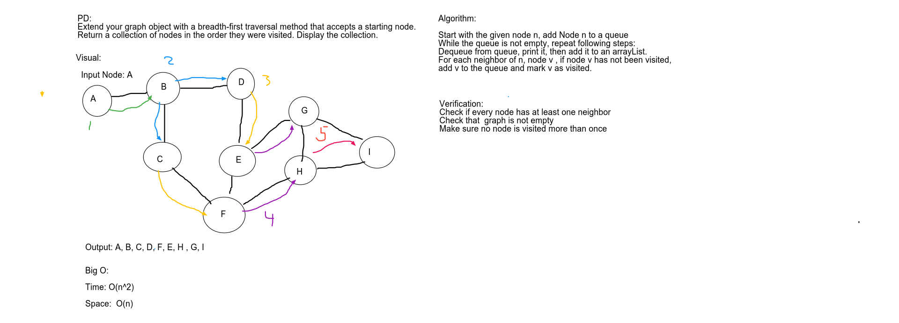 