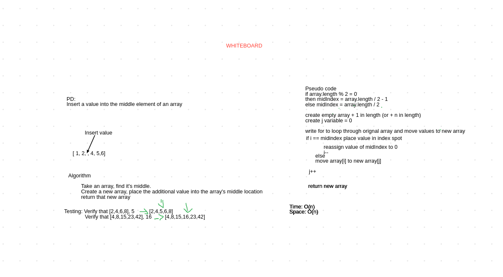
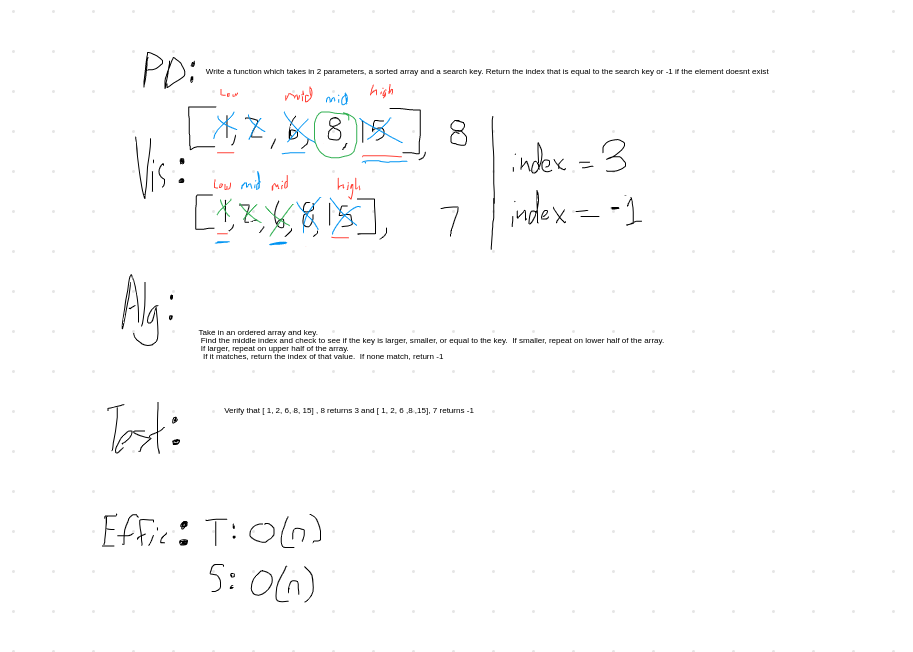

# Table of Contents
[Challenge 01: Reverse an Array](#reverse-an-array) 
[Challenge 02: Array Shift](#array-shift) 
[Challenge 03: Binary Search](#binary-search) 
[Challenge 05: Linked-List](#singly-linked-list);

## Reverse an Array
This method will reverse the order of a given array.
### Challenge
Write a function called reverseArray that takes in an Array as an argument and returns that array in reversed order
### Approach & Efficiency
I wrote a for loop that ran half the length of the array and swapped the indexes of of the first element with the last, the second with the second to last, and so on until the array is in reverse order. 
### Solution

## Array Shift
This method will add a value to the middle of any given array.
### Challenge
Write a function called arrayShift that takes in an array and an int as an argument and returns an array with the int added to the array in the middle index.
### Approach & Efficiency
Time: O(n) 
Space O(n)
### Solution

## Binary Search
This method will check to see if a value is in any given array.
### Challenge
Write a function called binarySearch that performs a search to see if a value is in an array. If there is, it returns the index of that value, if not, it returns -1.
### Approach & Efficiency
Time: O(n) 
Space O(n)
### Solution

## Singly Linked List
This method will create a linked list 

### Challenge
Write a class called linkedList that contains methods to insert values into the linked list, see if a value is included in the linked list, and to stringify the list.
### Approach and Efficiency
Insert:
Time: O(1) 
Space O(n)
Includes:
Time: O(n) 
Space O(1)
toString:
Time: O(n) 
Space O(n)
### API
LinkedList methods:
#### Insert
This method takes in an integer and creates a node with that interger as it's value and sets that node to the head of the linked list.
#### toString
This method returns a string showing the linked list
#### Includes
This method takes in an integer and checks all node values, returning true if that value is found and false if not.